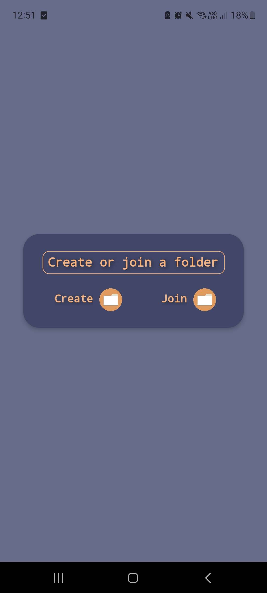
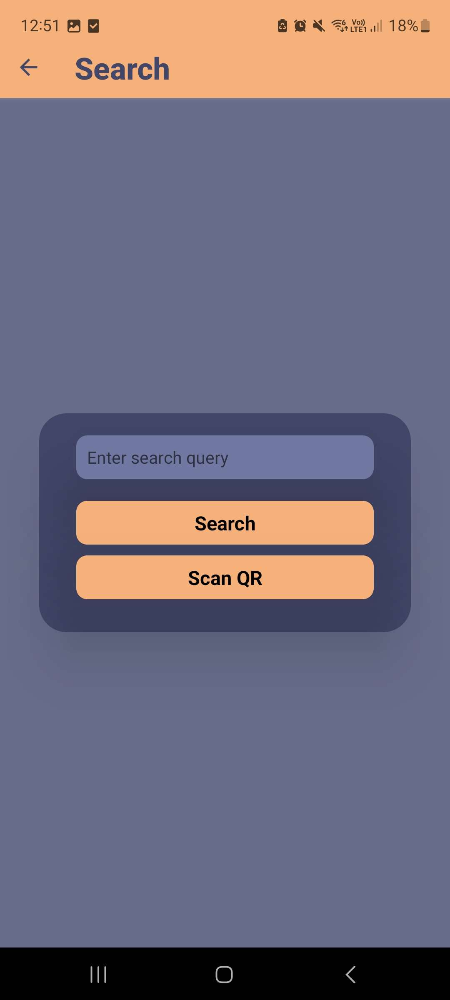
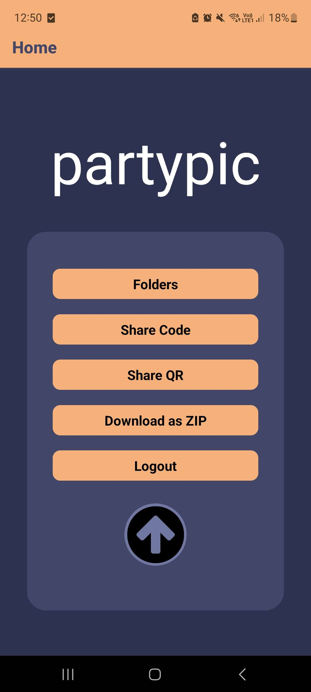

# PartyPic , an app made entirely in React Native

##📷📸📷📸📷📸📷📸📷📸📷📸📷📸📷📸📷📸

> This app is made for people who organise events and want to have one folder for every picture of videos took doring the said event.

P.S.  Adding a file to a folder is anonymous , meaning that anyone with the folder's code can add any file without the other users seeing who added the file.

### Creating or Joining the folders

    

> In this screen users can create or join a folder but the joinning it is done using the next screen.

    

> The users can search and join the folders by simply searching for the code or simply scan a QR code.

### The main page , here the 🪄 magic 🪄 happens.

    

> In this screen the users can upload , share or see the images in the folder they created or joined.
